# Documentação Técnica

> **Mundo Novo Café — Sistema de Gestão de Certificação**
> Arquitetura, decisões técnicas e guia de desenvolvimento.
> Atualizada a cada alteração publicada.

## Stack

| Camada | Tecnologia | Observações |
|---|---|---|
| Framework | **Next.js 16** (App Router, Turbopack) | Atenção: nesta versão o middleware chama-se `proxy.ts` |
| Linguagem | TypeScript (strict) | Domínio nomeado em português |
| Estilo | Tailwind CSS v4 + shadcn/ui (Base UI) | Tema customizado "verde café" em `src/app/globals.css` |
| Banco / Auth / Storage | **Supabase** (Postgres, RLS, Auth, Storage) | Migrations versionadas em `supabase/migrations/` |
| Hospedagem | **Vercel** | Deploy automático a cada push na `main` |
| Testes | Vitest + Testing Library (unidade/componente); Playwright planejado para E2E | CI no GitHub Actions a cada push |
| App de campo | PWA offline-first (Fase 4) | IndexedDB + fila de sincronização |
| Robô ALAICE | Python via GitHub Actions (Fase 8) | Agendado diariamente às 06:00 |

## Arquitetura

```
Navegador (gestor)  ──┐
                      ├──► Next.js (Vercel) ──► Supabase (Postgres + RLS + Auth + Storage)
PWA (consultor)  ─────┘            ▲
                                   │ escreve vencimentos
                Robô Python (GitHub Actions, diário)
```

- **Autenticação**: Supabase Auth com cookies via `@supabase/ssr`. O `src/proxy.ts` renova a sessão a cada requisição e protege `/painel/*`.
- **Modo demonstração**: enquanto as variáveis `NEXT_PUBLIC_SUPABASE_URL`/`ANON_KEY` não existem, o app roda sem autenticação com um aviso visível (`hasSupabaseEnv()` em `src/lib/supabase/env.ts`). Isso permite publicar na Vercel antes de conectar o banco.
- **Autorização**: papéis e o flag de alçada ficam na tabela `perfis`, espelhada de `auth.users` por trigger. Row Level Security em todas as tabelas.

## Estrutura de pastas

```
src/
  app/
    login/          # autenticação (Server Action `entrar`)
    painel/         # painel do gestor (layout com sidebar)
    docs/           # documentação interativa (renderiza docs/*.md)
  components/
    ui/             # componentes shadcn/ui
    barra-lateral.tsx
  lib/
    supabase/       # clientes server/browser + guarda de env
    vencimentos.ts  # regras de status e disparos de alerta
  proxy.ts          # sessão + proteção de rotas (Next 16)
docs/               # fonte da documentação (funcional.md, tecnica.md)
supabase/migrations/  # schema SQL versionado
```

## Modelo de dados (fundação)

Hierarquia definida na especificação: **Grupo → Cliente → Imóvel Rural → Talhão**, com Certificação como entidade própria por cliente.

Migration `0001_fundacao.sql`:

- enum `papel_usuario`: diretoria, juridico, comercial, gestor, consultor, auditor
- `perfis`: id (= auth.users), nome, papel, `alcada_aprovacao boolean` (regra: alçada é permissão, não etapa), ativo
- trigger `handle_new_user` cria o perfil no primeiro login
- RLS: usuário lê o próprio perfil; gestor/diretoria leem todos

Migration `0002_carteira.sql` — hierarquia completa da carteira:

- `grupos` (administração `mundo_novo` | `terceiro`)
- `clientes` (tipo `fazenda` | `cadeia_suprimentos`; campo `fase` implementa a etapa de implantação), `contatos_cliente` (por área), `registros_contato`
- `certificacoes` (entidade própria por cliente: norma RA/4C/Orgânico, vencimento, flag `principal`, `verificada_pelo_robo_em`)
- `imoveis_rurais` + `documentos_imovel` (CAR, matrícula, licença, ITR, georreferenciamento, averbação) + `captacoes_agua` (outorgas)
- `talhoes` + `safras` + `talhao_safras` (histórico por safra: previsão × colheita efetiva, estado da lavoura, poda/renovação)
- RLS uniforme: equipe autenticada e ativa (`eh_equipe_ativa()`) lê e escreve; papéis finos virão com os módulos

Camada de dados: `src/lib/carteira/` — `tipos.ts` (domínio), `dados-demo.ts` (carteira real usada no modo demonstração e futura carga inicial do banco), `consultas.ts` (interface única que hoje serve os dados demo e passará a consultar o Supabase sem mudar as telas).

As fases seguintes adicionam migrations incrementais (grupos, clientes, imóveis, talhões, safras, certificações, checklists, visitas, NCs/CAPAs, colaboradores, treinamentos, alertas).

## Regras de negócio codificadas

`src/lib/vencimentos.ts` — coberto por testes:

- `statusVencimento`: vencido (< 0 dias) · crítico (≤ 30) · atenção (≤ 120) · ok
- `disparosAtingidos`: marcos padrão 180/150/120/90/60/30 dias, com override por cliente; alerta persiste até resolução
- Formatação pt-BR de datas e áreas (hectares)

## Qualidade

- **Testes**: toda funcionalidade nasce com testes no mesmo commit (`*.test.ts[x]` ao lado do código). `npm test` roda tudo.
- **CI**: GitHub Actions executa lint + testes + build a cada push. Nada quebrado chega à `main`.
- **Documentação**: `docs/funcional.md` e `docs/tecnica.md` são atualizados no mesmo commit de cada funcionalidade e publicados na rota `/docs`.
- **Manual do usuário**: `src/lib/manual.ts` descreve cada tela (rota, passos, dicas); `scripts/gerar-manual.mjs` sobe o build e fotografa cada rota com Playwright em `public/manual/`. O job `manual` do CI regenera os prints a cada push na `main` e commita as mudanças (`[skip ci]`), que a Vercel publica — o manual em `/manual` sempre reflete o sistema no ar. Toda tela nova ganha sua entrada em `manual.ts` no mesmo commit.

## Módulos operacionais (madrugada de 23/08)

- **Migrations 0004–0008**: social completo (trabalhadores, moradias, treinamentos com `vence_em`, exames), operações (workflow com 6 etapas + movimentos, contratos com alçada, checklists versionados, visitas/respostas, CAPAs + ações, tarefas com unicidade por regra) e log do robô. **Gatilho no banco**: inserir resposta `nao_conforme` cria a CAPA automaticamente (trigger `nc_gera_capa`).
- **Motor por data** (`/api/gatilhos` + cron Vercel 06:00): varre certificações, documentos de imóvel, captações, treinamentos e CAPAs; materializa tarefas idempotentes (`unique regra+cliente+vence_em`). Régua em `src/lib/gatilhos.ts`.
- **Motor por evento**: mover cliente para `na_certificadora` gera tarefa de notificação; decisão de contrato validada server-side contra `alcada_aprovacao` do perfil logado.
- **Robô ALAICE** (`robo/verificar_alaice.py` + GitHub Action diária 06:00): consulta a fonte, carimba `verificada_pelo_robo_em` e registra em `execucoes_robo`; sem acesso ao site → `verificacao_assistida`.
- **CRUDs**: carteira (grupos/clientes/contatos/registros de contato), imóveis/talhões/safras/documentos/captações, social, checklists versionados (rascunho→publicação), visitas com respostas e conformidade, CAPAs (ações, fechamento condicionado), perfis + convite por Admin API (service key só no servidor).
- Padrão das camadas: `consultas.ts` (leitura, fallback demo p/ testes) + `acoes.ts` (Server Actions com zod) por módulo em `src/lib/<módulo>/`.

## Infraestrutura em produção

- **Supabase**: projeto `mundo-novo` (ref `qyegfrctafjghgprnihl`), região São Paulo (`sa-east-1`). Migrations 0001–0003 aplicadas; carteira real carregada.
- **Vercel**: projeto `mundo-novo` · produção em `https://mundo-novo-seven.vercel.app` (alias `mundo-novo-new-world2.vercel.app`). Env vars `NEXT_PUBLIC_SUPABASE_*` configuradas (production + preview).
- **Autenticação ativa**: `/painel/*` exige login (redirecionamento no `proxy.ts`); `/docs` e `/manual` são públicos. Onboarding por convite: e-mail → `/definir-senha` (o cliente do navegador captura a sessão do link e chama `updateUser`); recuperação em `/recuperar-senha`. `site_url` e `uri_allow_list` configurados via Management API.
- Deploy: `vercel deploy --prod --yes` (conexão Git para deploy automático pendente de instalação do app da Vercel no GitHub).

## Como rodar localmente

```bash
npm install
npm run dev        # http://localhost:3000
npm test           # testes
npm run lint       # lint
npm run build      # build de produção
```

Para conectar o Supabase: copie `.env.example` para `.env.local` e preencha com as chaves do projeto (Dashboard → Project Settings → API).

## Decisões registradas

| Decisão | Motivo |
|---|---|
| PWA em vez de app nativo | Decisão da reunião de 19/08 — evita lojas de aplicativo e reduz custo inicial |
| Supabase | Postgres gerenciado com RLS, Auth e Storage integrados; plano gratuito para começar |
| Domínio em português | O produto, a equipe e a cliente falam português; o código do domínio acompanha |
| Robô como GitHub Actions | Sem servidor próprio; log visível; grava no Supabase via API |
| Docs dentro do app | A Vercel publica a cada commit — documentação sempre sincronizada com o código |

## Banco de dados — estrutura e diagrama

**Motor:** PostgreSQL 17 (gerenciado pelo Supabase, região São Paulo). Todo o esquema vive em `supabase/migrations/` como **SQL padrão** — portável para qualquer PostgreSQL. Segurança por Row Level Security em todas as tabelas: equipe autenticada (perfil ativo sem vínculo de cliente) lê/escreve; usuários do portal (perfil com `cliente_id`) enxergam apenas os próprios dados.

```mermaid
erDiagram
    GRUPOS ||--o{ CLIENTES : "agrupa"
    CLIENTES ||--o{ CONTATOS_CLIENTE : "contatos por área"
    CLIENTES ||--o{ REGISTROS_CONTATO : "histórico"
    CLIENTES ||--o{ CERTIFICACOES : "possui"
    CLIENTES ||--o{ IMOVEIS_RURAIS : "possui"
    IMOVEIS_RURAIS ||--o{ DOCUMENTOS_IMOVEL : "CAR, licenças…"
    IMOVEIS_RURAIS ||--o{ CAPTACOES_AGUA : "outorgas"
    IMOVEIS_RURAIS ||--o{ TALHOES : "possui"
    IMOVEIS_RURAIS ||--o{ MAPAS_IMOVEL : "KML/GeoJSON"
    TALHOES ||--o{ TALHAO_SAFRAS : "histórico"
    SAFRAS ||--o{ TALHAO_SAFRAS : "por safra"
    CLIENTES ||--o| PROCESSOS_CERTIFICACAO : "etapa do workflow"
    PROCESSOS_CERTIFICACAO ||--o{ MOVIMENTOS_WORKFLOW : "auditoria de movimentos"
    CLIENTES ||--o{ VISITAS : "auditorias"
    CHECKLISTS ||--o{ CHECKLIST_VERSOES : "versionado"
    CHECKLIST_VERSOES ||--o{ CHECKLIST_ITENS : "itens da norma"
    VISITAS ||--o{ VISITA_RESPOSTAS : "respostas"
    CHECKLIST_ITENS ||--o{ VISITA_RESPOSTAS : "responde"
    VISITAS ||--o{ VISITA_FOTOS : "evidências GPS"
    CLIENTES ||--o{ CAPAS : "não conformidades"
    VISITAS ||--o{ CAPAS : "NC gera (trigger)"
    CAPAS ||--o{ CAPA_ACOES : "ações corretivas"
    CAPAS ||--o{ CAPA_EVIDENCIAS : "evidências"
    CLIENTES ||--o{ TAREFAS : "agenda (2 motores)"
    CLIENTES ||--o{ TRABALHADORES : "módulo social"
    CLIENTES ||--o{ MORADIAS : "casas"
    MORADIAS ||--o{ MORADORES : "moradores"
    TREINAMENTOS ||--o{ TREINAMENTO_PARTICIPACOES : "turmas"
    TRABALHADORES ||--o{ TREINAMENTO_PARTICIPACOES : "participa"
    CLIENTES ||--o{ LOTES : "comercialização"
    SAFRAS ||--o{ LOTES : "da safra"
    LOTES ||--o{ NEGOCIACOES : "negócios"
    CLIENTES ||--o{ CONFIG_ALERTAS_CLIENTE : "override da régua"
    PERFIS ||--o{ CONTRATOS : "decide (alçada)"
    PERFIS }o--o| CLIENTES : "portal (cliente_id)"
    EXECUCOES_ROBO {
        string status
        int certificados_consultados
    }
    ENVIOS_EMAIL {
        string destinatario
        string status
    }
```



Tabelas de apoio sem relacionamento no diagrama: `perfis` (espelho de auth.users com papel, alçada, `deve_trocar_senha` e `cliente_id`), `exames_cargo`, `execucoes_robo`, `envios_email`.

## De → Para: planilhas da cliente → banco de dados

A estrutura foi desenhada a partir das três planilhas reais enviadas pela Mundo Novo Café. **Cobertura: 100% dos campos** — mapeamento abaixo.

### CONTROLE AMBIENTAL (aba "Documentos Legais")

| Campo da planilha | Destino no banco |
|---|---|
| Nome do Imóvel Rural | `imoveis_rurais.nome` |
| Proprietário(s) | `imoveis_rurais.proprietarios` |
| Registro do CAR | `imoveis_rurais.car` + `documentos_imovel` (tipo `car`) |
| Matrícula(s) | `imoveis_rurais.matriculas` |
| Área Total (ha) | `imoveis_rurais.area_total_ha` |
| Área de Café (ha) | `imoveis_rurais.area_cafe_ha` |
| Área de APP (ha) | `imoveis_rurais.area_app_ha` |
| Área de Reserva Legal (ha) | `imoveis_rurais.area_reserva_ha` |
| Talhão (lista por imóvel) | `talhoes.nome` (chave `imovel_id`) |
| Possui Captação de Água? | `imoveis_rurais.possui_captacao_agua` |
| Documento (Licença/Certidão de Dispensa) | `documentos_imovel.tipo` (`licenca`/`dispensa_licenca`) + `identificacao` |
| Data de Vencimento do documento | `documentos_imovel.vence_em` (monitorado pelo motor de alertas) |
| Status Documento (OK/Vencido/Próximo) | `documentos_imovel.status` |
| Usos da Água — Nº Processo | `captacoes_agua.processo` |
| Usos da Água — Tipo de Captação | `captacoes_agua.tipo_captacao` |
| Usos da Água — Identificação (Uso insignificante…) | `captacoes_agua.classificacao` |
| Usos da Água — Vencimento / Status | `captacoes_agua.vence_em` / `.status` |
| Aba "Planilha1" (totais por fazenda) | visão calculada (soma dos imóveis) — sem redigitação |
| Data de Atualização / Responsável | automático: `criado_em`/`atualizado_em` + autor da sessão |

### LISTA DE TRABALHADORES (Dutra da Serra)

| Campo da planilha | Destino no banco |
|---|---|
| Colaborador(a) | `trabalhadores.nome` |
| Fixo × Temporário (abas) | `trabalhadores.vinculo` |
| Função / CBO | `trabalhadores.funcao` / `.cbo` |
| Fazenda / Produtor | `trabalhadores.cliente_id` |
| Salário / Admissão / Nascimento / Gênero / Cultura | `salario` / `admissao` / `nascimento` / `genero` / `cultura` |
| Benefícios (Moradia, Alimentação, Transporte, Cesta) | booleanos `moradia`/`alimentacao`/`transporte`/`cesta_basica` |
| Gratificações / Insalubridade 20% / Periculosidade 30% | booleanos correspondentes |
| Funções (Abastecimento, Defensivos, Colhedeira, Trator, Processamento, Outros) | `funcoes_habilitadas` (lista) |
| Aba "Informações de Moradia" — CASA NN | `moradias.nome` |
| Morador / Parentesco / Nascimento / Gênero | `moradores.*` (vínculo opcional ao trabalhador) |
| Aba "Exames-Treinamentos" — treinamento × periodicidade | `treinamentos.nome` / `.norma` / `.periodicidade_meses` |
| Matriz trabalhador × data de realização | `treinamento_participacoes.realizado_em` + `vence_em` calculado |
| Legenda Atualizado/Vencido/Próximo/NA | status **calculado** pelo sistema (sem redigitação) |
| Aba "Periodicidade Exames" — cargo × exames | `exames_cargo.*` |

### ESTIMATIVA DE SAFRA — PODA E RENOVAÇÃO

| Campo da planilha | Destino no banco |
|---|---|
| Abas por safra (2021-2022 … 2025-2026) | `safras.rotulo` |
| Talhão | `talhoes.nome` |
| Fazenda/Produtor | produtor do imóvel (`imoveis_rurais.proprietarios`) |
| Área (ha) | `talhoes.area_ha` |
| Número de Plantas/ha | `talhoes.plantas_por_ha` |
| Espaçamento (metros) | `talhoes.espacamento` |
| Variedade | `talhoes.variedade` |
| Ano de Plantio | `talhoes.ano_plantio` |
| Estado Físico da Lavoura | `talhao_safras.estado_lavoura` (por safra) |
| Colheita Efetiva (sacas) | `talhao_safras.colheita_efetiva_sacas` |
| Previsão de colheita (sacas) | `talhao_safras.previsao_sacas` |
| Previsão de Poda e Renovação | `talhao_safras.previsao_poda_renovacao` |
| Área (ha) Irrigação | `talhoes.area_irrigada_ha` |
| Descrição da Metodologia | `talhao_safras.metodologia_previsao` |
| Data de Atualização / Responsável | `talhao_safras.atualizado_em` / `.atualizado_por` |

## Portabilidade e migração de arquitetura

O projeto foi estruturado para migrar de nuvem sem reescrita:

- **Banco**: migrations em SQL padrão do PostgreSQL — aplicam em qualquer Postgres (17+) com `psql`/CI. Dados exportáveis com `pg_dump`.
- **Aplicação**: `Dockerfile` (build standalone do Next) + `docker-compose.yml` no repositório. Roda em qualquer servidor com Docker (on-premise, outra nuvem, VPS).
- **Pontos com dependência do Supabase** (isolados na camada `src/lib/supabase/`): autenticação (GoTrue), storage de arquivos e as chamadas Admin API. Dois caminhos de migração:
  1. **Supabase self-hosted** (recomendado p/ on-premise): a stack oficial roda em Docker e mantém 100% de compatibilidade — nenhuma alteração de código; ou
  2. **Postgres puro + substituições**: trocar auth/storage por equivalentes (ex.: Keycloak + MinIO) reescrevendo apenas `src/lib/supabase/*` — o restante do código consome essa camada.
- **Agendamentos**: crons da Vercel (`vercel.json`) viram `cron` do servidor chamando `/api/gatilhos` e `/api/resumo-semanal` com o `CRON_SECRET`; o robô (GitHub Actions) roda em qualquer agendador com Python 3.
- **E-mail**: SMTP genérico via variáveis `SMTP_*` — funciona com Gmail gratuito, servidor corporativo ou qualquer provedor.
